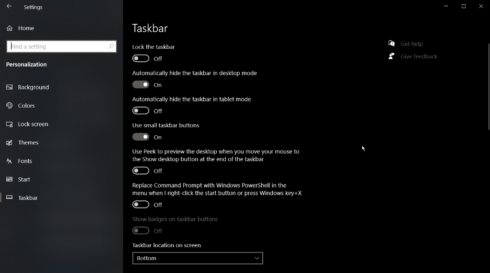

# Windows Taskbar Auto-Hide Fix & Smart Toggle (AutoHotkey v2)

> 彻底解决 Windows 自动隐藏任务栏恶性 Bug、第三方通知偷弹乱闪，提供原生级「三击 Win 暂时持久化 + Win+数字切应用 + 点击外部自收回」的极致沉浸式体验。

---

## 📌 为什么需要这个工具？（痛点与背景）

Windows 系统自带的「自动隐藏任务栏」在全屏办公、编程沉浸、打游戏或观看视频时是极佳的桌面清理方案，但 Windows 底层存在数个难以忍受的顽固 Bug：

1. **第三方应用通知强行劫持（偷弹卡死）**：
   - 微信、QQ、钉钉等国内应用通过 `NIM_MODIFY` 发送托盘通知或新消息时，会强行绕过用户设置，直接将 Windows 任务栏（`Shell_TrayWnd`）强行弹出并卡在最前端，遮挡工作区，且无法自动缩回。
2. **任务栏状态不同步与失效**：
   - 经常需要按多次 Win 键或狂点屏幕才能勉强缩回去，极度破坏心流。
3. **临时整理与常驻的矛盾**：
   - 当你想要拖拽重新排列任务栏 Pin 图标、整理应用顺序，或者使用任务栏搜索/托盘时，鼠标稍一偏离任务栏就会瞬间收回，操作极度痛苦；但若关闭自动隐藏，又失去了全屏纯净的桌面空间。

本项目通过精确的 Windows API（`User32\ShowWindow`）控制 + 看门狗机制 + 智能按键状态机，彻底终结上述所有问题。

---

## 🌟 强烈推荐：使用 V8 版本

本项目收录了版本迭代过程中的完整代码，**日常使用强烈推荐直接运行 `8TaskbarToggle_FuxxkingMicrosoft.ahk`**！

### 💡 V8 核心特性

| 功能模块 | V8（推荐 ⭐⭐⭐⭐⭐） | V7（历史版本） |
| :--- | :--- | :--- |
| **持久化唤起** | **快速按 3 下 Win 键**（450ms窗口，防误触） | 单按 1 下 Win 键（极易误触发，造成频繁常驻） |
| **退出持久化** | **点击任务栏 UI 之外任何区域** 或 **单按 1 下 Win 键** | 依赖检测开始菜单关闭（容易失同步卡死） |
| **Pin 应用快速切换** | **完美支持 `Win+1/2/3/4...`**（瞬间显示任务栏供系统定位，松开自动秒收） | 仅在任务栏常驻或菜单展开时响应 |
| **系统组合快捷键** | `Win+E`、`Win+R`、`Win+D`、`Win+V`、`Win+Tab` 原生无冲突放行 | 正常支持 |
| **通知偷弹压制** | **800ms 看门狗巡查**（微信/QQ偷弹 1 秒内必被强行压回） | 800ms 看门狗巡查 |
| **拖拽 Pin 图标** | 三击呼出持久化后，任务栏绝对常驻，**可从容拖拽 Pin 排序** | 容易意外关闭 |

---

## ⚙️ 必备前提设置（Prerequisites）

为保证脚本正常生效，请确保 Windows 系统已开启 **「在桌面模式下自动隐藏任务栏」**。

### 设置路径：
1. 打开 Windows **设置 (Settings)** -> **个性化 (Personalization)** -> **任务栏 (Taskbar)**。
2. 将 **「在桌面模式下自动隐藏任务栏 (Automatically hide the taskbar in desktop mode)」** 设为 **开 (On)**。

> **推荐参考配置**：
> - 锁定任务栏：关 (Off)
> - **在桌面模式下自动隐藏任务栏：开 (On)**
> - 在平板电脑模式下自动隐藏任务栏：关 (Off)
> - 使用小任务栏按钮：开 (On)（根据个人喜好）
> - 任务栏在屏幕上的位置：底部 (Bottom)

---

## 🕹️ V8 交互操作指南

### 1. 常态工作模式（默认隐藏）
- 任务栏始终保持彻底隐藏状态，全屏画面纯净无遮挡。
- **看门狗（Inspector）** 每 800ms 巡查一次屏幕。如果微信/QQ/系统通知偷偷把任务栏弹出来，看门狗将在 1 秒内自动调用 `SW_HIDE` 将其压回去。
- 按下 `Win+1`、`Win+2`、`Win+3` 等快捷键时，系统毫秒级显隐任务栏并完成软件切换，松开后 150ms 自动隐去。
- 按下 `Win+E`、`Win+R`、`Win+V` 等快捷键正常工作，完全不会残留任务栏。

### 2. 唤起暂时持久化模式（整理图标 / 任务栏搜索）
- **快速轻按 3 下 Win 键**（在 450ms 内完成连击）。
- 任务栏立即平滑浮现并进入 **「持久化常驻」** 状态：
  - 看门狗自动休眠，不会将任务栏压回。
  - 用户可任意拖拽调整 Pin 图标位置、点击搜索栏、右键菜单、管理托盘图标。

### 3. 退出持久化模式（双重退出）
- **方式一（点外部）**：点击任务栏、副屏任务栏、开始菜单、托盘溢出菜单之外的**任意屏幕区域**（如桌面空白处、浏览器、VS Code、游戏等），任务栏立即收回隐藏。
- **方式二（按 Win）**：在持久化模式下，**单按一次 Win 键**，任务栏立即收回隐藏。

---

## 🚀 安装与使用

### 运行环境
- Windows 10 / Windows 11 (x64)
- **[AutoHotkey v2.0+](https://www.autohotkey.com/)**（必须是 AHK v2，不兼容 AHK v1）

### 快速启动
1. 安装 AutoHotkey v2。
2. 双击运行 `8TaskbarToggle_FuxxkingMicrosoft.ahk`（脚本会自动请求管理员权限以保证对高权限应用窗口生效）。

### 设置开机自启动
1. 按下快捷键 `Win + R`，输入 `shell:startup` 并回车，打开「启动」文件夹。
2. 将 `8TaskbarToggle_FuxxkingMicrosoft.ahk` 创建一个**快捷方式**（Shortcut）。
3. 将快捷方式粘贴到「启动」文件夹中即可。

---

## 📂 文件清单

- **`8TaskbarToggle_FuxxkingMicrosoft.ahk`**：🌟 **推荐使用**。全新 V8 状态机架构，支持三击持久化、外部点击自退出、Win+数字切应用、看门狗压制通知。
- **`7TaskbarToggle_FuxxkingMicrosoft.ahk`**：V7 历史版本（单按 Win 展开，存在易误触发常驻的缺点）。
- **`6TaskbarToggle_FuxxkingMicrosoft.ahk`**：V6 早期探索版本。
- **`5TaskbarToggle_FuxxkingMicrosoft.ahk`**：V5 早期基础原型。
- **`taskbar_settings.png`**：Windows 必备任务栏设置项参考截图。

---

## 📄 开源协议

本项目采用 [MIT License](LICENSE) 开源协议，欢迎自由 Fork、修改与分发。
